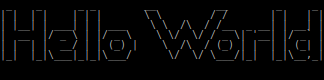
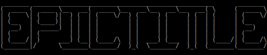
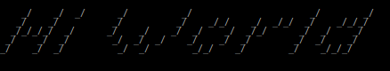

# my-figlet-font-selection

A selection of ASCII Fonts from www.figlet.org/

## 5lineoblique

unknown, 1995/01

## big

Glenn Chappell,	1993/04 

## block

Glenn Chappell,	1993/04

## bubble

Glenn Chappell,	1993/04

## bulbhead

Jef Poskanzer,	1994/06 

## digital

Glenn Chappell,	1994/01

## doh

Curtis Wanner,	1995/04

## doom

Frans P. de Vries,	1996/06

## dotmatrix

Curtis Wanner,	1995/08

## epic

Claude Martins,	1994/12

## isometric3

Kent Nassen,	1994/10

## larry3d

Larry Gelberg,	1994/02

## lean

Glenn Chappell,	1993/04

## nancyj

-fancy	Eamon Daly

## nipples

Ron Fritz,	1994/08

## puffy

Juan Car,	1994/03

## rectangles

David Villegas,	1994/12

## small

Glenn Chappell,	1996/03

## smkeyboard

Kent Nassen,	1994/11

## standard

Glenn Chappell & Ian Chai,	1993/03

## starwars

Ryan Youck,	1994/12

## straight

Bas Meijer

