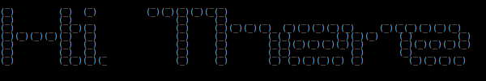
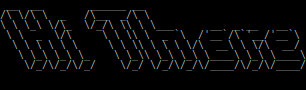
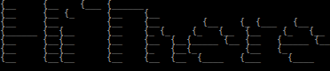
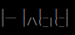

# my-figlet-font-selection

A selection of ASCII Fonts from www.figlet.org/

## Table of Content

1. [5lineoblique](#5lineoblique)
1. [big](#big)
1. [block](#block)
1. [bubble](#bubble)
1. [bulbhead](#bulbhead)
1. [digital](#digital)
1. [doh](#doh)
1. [doom](#doom)
1. [dotmatrix](#dotmatrix)
1. [epic](#epic)
1. [isometric3](#isometric3)
1. [larry3d](#larry3d)
1. [lean](#lean)
1. [nancy](#nancy)
1. [nipples](#nipples)
1. [puffy](#puffy)
1. [rectangles](#rectangles)
1. [small](#small)
1. [smkeyboard](#smkeyboard)
1. [standard](#standard)
1. [starwars](#starwars)
1. [straight](#straight)

## [5lineoblique](fonts/5lineoblique.flf)  [↸](#toc)

unknown, 1995/01

## [big](fonts/big.flf)  [↸](#toc)

Glenn Chappell,	1993/04 

## [block](fonts/block.flf)  [↸](#toc)

Glenn Chappell,	1993/04

## [bubble](fonts/bubble.flf)  [↸](#toc)

Glenn Chappell,	1993/04

## [bulbhead](fonts/bulbhead.flf)  [↸](#toc)

Jef Poskanzer,	1994/06 

## [digital](fonts/digital.flf)  [↸](#toc)

Glenn Chappell,	1994/01

## [doh](fonts/doh.flf)  [↸](#toc)

Curtis Wanner,	1995/04

## [doom](fonts/doom.flf)  [↸](#toc)

Frans P. de Vries,	1996/06

## [dotmatrix](fonts/dotmatrix.flf)  [↸](#toc)

Curtis Wanner,	1995/08

## [epic](fonts/epic.flf)  [↸](#toc)

Claude Martins,	1994/12

## [isometric3](fonts/isometric3.flf)  [↸](#toc)

Kent Nassen,	1994/10

## [larry3d](fonts/larry3d.flf)  [↸](#toc)

Larry Gelberg,	1994/02

## [lean](fonts/lean.flf)  [↸](#toc)

Glenn Chappell,	1993/04

## [nancy](fonts/nancy.flf)jj-fancy [↸](#toc)

Eamon Daly

## [nipples](fonts/nipples.flf)  [↸](#toc)

Ron Fritz,	1994/08

## [puffy](fonts/puffy.flf)  [↸](#toc)

Juan Car,	1994/03

## [rectangles](fonts/rectangles.flf)  [↸](#toc)

David Villegas,	1994/12

## [small](fonts/small.flf)  [↸](#toc)

Glenn Chappell,	1996/03

## [smkeyboard](fonts/smkeyboard.flf)  [↸](#toc)

Kent Nassen,	1994/11

## [standard](fonts/standard.flf)  [↸](#toc)

Glenn Chappell & Ian Chai,	1993/03

## [starwars](fonts/starwars.flf)  [↸](#toc)

Ryan Youck,	1994/12

## [straight](fonts/straight.flf)  [↸](#toc)

Bas Meijer

